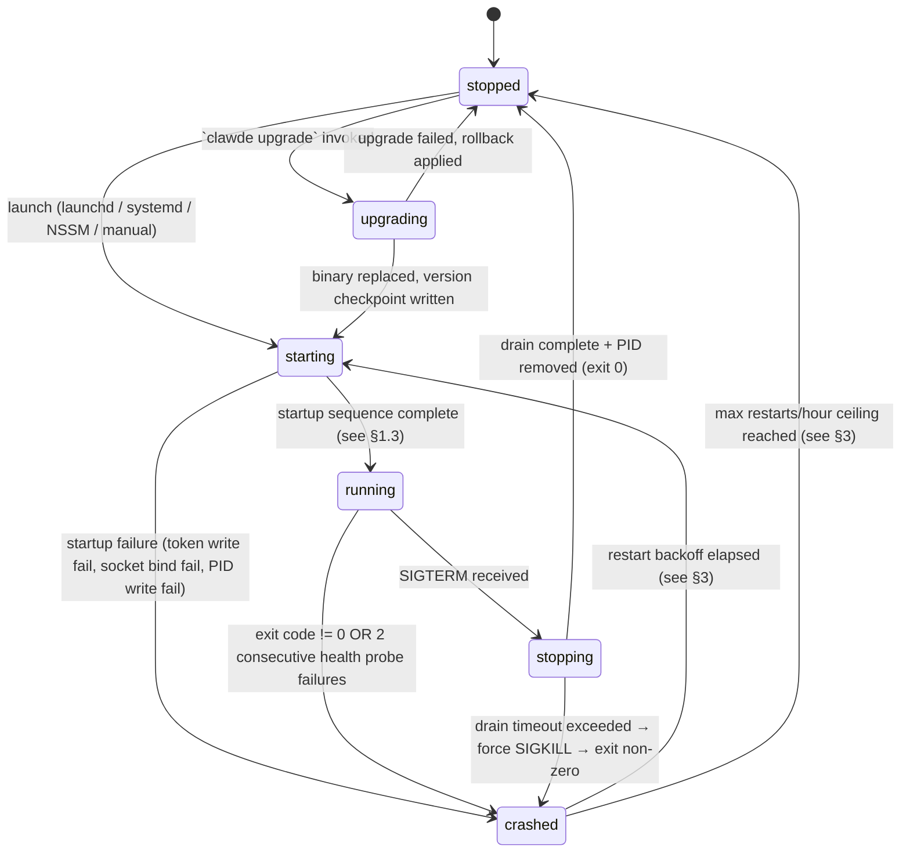

# ClawDE Daemon Specification (`clawd`)

**Spec version:** P1-E2-W4-S04-T02  
**Status:** Planned  
**References:** ADR-001, ADR-004, ADR-008  
**Scope:** `clawd` host-local workstation agent (Rust/SQLite) lifecycle only. The `clawde-intelligence` Go/Postgres sidecar lifecycle is defined in E5.

---

## 1. State Machine

### 1.1 States

| State | Description |
|---|---|
| `stopped` | Process is not running. PID file absent. All sockets closed. |
| `starting` | Process has launched. Generating workspace token, binding MCP socket, writing PID file. |
| `running` | All startup steps confirmed. Serving MCP tool calls. Health probe active. |
| `stopping` | SIGTERM received. Draining in-flight tool calls. Cleaning up. |
| `crashed` | Process exited with non-zero code OR health probe failed 2 consecutive times. Restart policy takes over. |
| `upgrading` | In-place binary upgrade. `stopped` sub-state with a version checkpoint written. |

### 1.2 State Diagram



### 1.3 Startup Sequence (LOCKED — LEDGER §G, cross-checked with T01-ST05)

The ordering is strict. Each step must succeed before the next begins.

1. **Generate workspace token** — compute `HMAC-SHA256(workspace_id || pid || boot_time, $CLAWDE_SESSION_SECRET)`. Write to `~/.claude/hooks/.clawde-token-<workspace>` with mode 0600. Fail startup if write fails. Token TTL: 24 hours or until the daemon exits, whichever is sooner. Use `clawde token rotate` to revoke the active token and generate a new one (ADR-004).
2. **Bind MCP socket** — open Unix domain socket at `/tmp/clawd.<workspace>.sock` (Linux/macOS) or TCP `127.0.0.1:7430` (Windows fallback). Fail startup if bind fails (address in use = prior unclean exit; run stale-lock detection first).
3. **Write PID file** — atomically write PID to `~/.local/share/clawde/daemon.pid` using `O_CREAT|O_EXCL` (see §2). Fail startup if write fails (another daemon instance is live).
4. **Report running state** — emit structured log line `{ts, event="daemon_started", pid, workspace_id, mcp_socket, token_path}`. Transition to `running`.

### 1.4 Transition Table

| From | To | Trigger | Actions |
|---|---|---|---|
| `stopped` | `starting` | OS launch agent / manual start | Fork process, begin startup sequence |
| `starting` | `running` | All 4 startup steps pass | Enable health probe, accept MCP connections |
| `starting` | `crashed` | Any startup step fails | Log error, exit non-zero |
| `running` | `stopping` | SIGTERM | Stop accepting new MCP connections, begin drain |
| `running` | `crashed` | Exit code != 0 OR 2 consecutive health failures | Log crash, hand off to restart policy |
| `stopping` | `stopped` | Drain complete, PID removed, exit 0 | — |
| `stopping` | `crashed` | Drain timeout (10s) exceeded | SIGKILL, exit non-zero, restart policy applies |
| `crashed` | `starting` | Backoff timer elapsed, ceiling not hit | OS launch agent retries, or manual restart |
| `crashed` | `stopped` | Restart ceiling hit (5/hour) | OS notification sent, no further auto-restart |
| `stopped` | `upgrading` | `clawde upgrade` | Write version checkpoint, replace binary |
| `upgrading` | `starting` | Upgrade success | Normal startup sequence |
| `upgrading` | `stopped` | Upgrade failure | Rollback applied, emit upgrade_failed log |

---

## 2. PID File and Lock File

### 2.1 Location

```
~/.local/share/clawde/daemon.pid
```

On macOS and Linux, `~` is `$HOME`. On Windows, use `%LOCALAPPDATA%\clawde\daemon.pid`.

### 2.2 Stale-Lock Detection

On startup, before `O_CREAT|O_EXCL` write:

1. Check if `daemon.pid` exists.
2. If it exists: read the PID value.
3. Send `kill -0 <pid>` (zero signal — existence check only, no signal delivered).
   - If `kill -0` returns 0 (process exists): another `clawd` is live. Abort startup with error `ERR_DAEMON_ALREADY_RUNNING`.
   - If `kill -0` returns `ESRCH` (no such process): PID file is stale from unclean exit. Remove it and proceed.
4. On Windows: use `OpenProcess(PROCESS_QUERY_INFORMATION)` instead of `kill -0`. If `GetLastError()` returns `ERROR_INVALID_PARAMETER`, the process does not exist; remove stale PID file.

### 2.3 Race Prevention

The PID file write uses `O_CREAT|O_EXCL` (Rust: `OpenOptions::new().create_new(true)`):

- This is an atomic syscall. If two processes both pass the stale-lock check simultaneously (TOCTOU window), only one succeeds. The loser gets `EEXIST` and must abort.
- **Never** use `File::create()` for the PID file — it truncates and writes without atomicity guarantees.

### 2.4 PID File Cleanup

The PID file is removed in the `stopping → stopped` transition (step 5 in §4, after log flush, before `exit 0`). If the process is SIGKILL'd, the PID file remains; stale-lock detection cleans it on next startup.

---

## 3. Restart Policy

### 3.1 Crash Detection

A crash is declared when either of the following occurs:
- The `clawd` process exits with a non-zero exit code.
- The health probe (§5) reports 2 consecutive failures.

### 3.2 Backoff Schedule

| Restart attempt | Delay before retry |
|---|---|
| 1st restart | 5 seconds |
| 2nd restart | 10 seconds |
| 3rd restart and beyond | 30 seconds |

### 3.3 Restart Ceiling

- **Maximum restarts per hour:** 5.
- **Counter reset:** After 1 hour of continuous clean uptime (no crash, no restart), the restart counter resets to 0.
- **Ceiling action:** When the 5th restart within 1 hour fails (or the process crashes after the 5th restart within 1 hour), the auto-restart policy halts:
  1. Send OS notification: "ClawDE daemon has crashed repeatedly. Manual restart required." (use `osascript` on macOS, `notify-send` on Linux, Windows Toast on Windows).
  2. Write audit log entry: `{ts, event="RESTART_LIMIT_REACHED", restart_count=5, window_seconds=3600}`.
  3. Transition to `stopped`. No further automatic restart.

### 3.4 OS-Level Restart Mechanism

Platform launch agents (§6) provide the primary restart loop. The ClawDE daemon itself does not self-fork. The backoff is implemented via `ThrottleInterval` (launchd) and `RestartSec` + `StartLimitIntervalSec` (systemd). NSSM on Windows has a native restart throttle.

---

## 4. Graceful Shutdown Protocol

Triggered by `SIGTERM` (Unix) or `SERVICE_CONTROL_STOP` (Windows SCM). Ordered steps:

1. **Stop accepting new MCP connections** — close the accept loop on the MCP socket immediately. In-flight connections continue.
2. **Drain in-flight tool calls** — wait up to **10 seconds** for all active MCP tool calls to complete. Each call has its own deadline; the drain window is the outer deadline.
3. **Force-kill on SIGKILL** — if the 10-second drain window elapses without completion, the OS sends SIGKILL (launchd: `ExitTimeoutEnabled` + `ExitTimeoutSeconds=10`; systemd: `TimeoutStopSec=10`; NSSM: `AppStopMethodSkip` + `AppKillProcessTree`). On SIGKILL, no cleanup is guaranteed; OS handles process table and file descriptor reclamation.
4. **Close MCP socket** — after drain, close and unlink the Unix socket file (or close the TCP listener).
5. **Flush structured logs** — write final shutdown audit row: `{ts, event="shutdown", pid, uptime_s, in_flight_drained}`. Flush log buffer to disk.
6. **Remove PID file** — unlink `~/.local/share/clawde/daemon.pid`.
7. **Exit 0** — clean exit. launchd/systemd/NSSM detect exit 0 and do not trigger restart policy.

**ADR-008 cross-reference:** The 2-second hook timeout (ADR-008 §HookContract rule 1) is subordinate to the graceful shutdown drain window. Hooks have their own 2-second deadline per invocation; the 10-second shutdown window is the aggregate drain for all in-flight MCP tool calls.

---

## 5. Health Check and Heartbeat

### 5.1 Probe Interval

Default: **30 seconds**.  
Configurable via `CLAWDE_HEALTH_INTERVAL_SECS` env var (min: 10, max: 300).

### 5.2 Probes Run on Each Cycle

| Probe | Pass condition |
|---|---|
| **MCP socket bind** | Unix socket or TCP port is still bound and accepting connections |
| **SQLite WAL** | `PRAGMA wal_checkpoint` completes without error; no stuck WAL lock |
| **Last tool call age** | Last successful MCP tool call was within `CLAWDE_TOOL_TIMEOUT_SECS` (default 300) seconds. Passes if no tool calls have been received yet (fresh start). |

### 5.3 Failure Threshold

- **2 consecutive probe failures** → health check declares process unhealthy → transition to `crashed` state.
- A single failure followed by a pass resets the consecutive counter to 0.

### 5.4 Health Probe → Crash State

On 2nd consecutive failure:
1. Emit audit log: `{ts, event="health_check_failed", consecutive_failures=2, probe_results=[...]}`.
2. Initiate graceful shutdown sequence (§4). If shutdown completes cleanly, transition `running → stopping → stopped`.
3. Restart policy applies: if PID file is absent (clean stop), launch agent restarts with backoff.
4. State machine transitions: `running → crashed → starting` (per §1.4).

---

## 6. Platform-Specific Launch Mechanisms

### 6.1 macOS — launchd

**Agent plist path:** `~/Library/LaunchAgents/io.nself.clawde.plist`

```xml
<?xml version="1.0" encoding="UTF-8"?>
<!DOCTYPE plist PUBLIC "-//Apple//DTD PLIST 1.0//EN" "http://www.apple.com/DTDs/PropertyList-1.0.dtd">
<plist version="1.0">
<dict>
    <key>Label</key>
    <string>io.nself.clawde</string>

    <key>ProgramArguments</key>
    <array>
        <string>/usr/local/bin/clawde</string>
        <string>daemon</string>
        <string>start</string>
    </array>

    <key>RunAtLoad</key>
    <true/>

    <key>KeepAlive</key>
    <true/>

    <key>ThrottleInterval</key>
    <integer>5</integer>

    <key>StandardOutPath</key>
    <string>~/.local/share/clawde/logs/daemon.stdout.log</string>

    <key>StandardErrorPath</key>
    <string>~/.local/share/clawde/logs/daemon.stderr.log</string>

    <key>ExitTimeoutEnabled</key>
    <true/>

    <key>ExitTimeoutSeconds</key>
    <integer>15</integer>

    <key>EnvironmentVariables</key>
    <dict>
        <key>CLAWDE_WORKSPACE</key>
        <string>default</string>
    </dict>
</dict>
</plist>
```

**Management commands:**
```bash
# Install and start
launchctl bootstrap gui/$(id -u) ~/Library/LaunchAgents/io.nself.clawde.plist

# Stop
launchctl bootout gui/$(id -u) ~/Library/LaunchAgents/io.nself.clawde.plist

# Restart
launchctl kickstart -k gui/$(id -u)/io.nself.clawde

# Check status
launchctl print gui/$(id -u)/io.nself.clawde
```

**Notes:**
- `KeepAlive=true` causes launchd to restart on any exit (including exit 0). Use `bootout` to fully stop.
- `ThrottleInterval=5` provides the 5-second minimum restart delay (maps to restart attempt 1 backoff).
- `ExitTimeoutSeconds=15` gives the daemon 15 seconds to drain before launchd sends SIGKILL (covers the 10-second drain window plus 5 seconds margin).

### 6.2 Linux — systemd (user unit)

**Unit file path:** `~/.config/systemd/user/clawde.service`

```ini
[Unit]
Description=ClawDE background daemon (clawd)
Documentation=https://github.com/nself-org/clawde/wiki/daemon-spec
After=network.target

[Service]
Type=simple
ExecStart=/usr/local/bin/clawde daemon start
ExecStop=/usr/local/bin/clawde daemon stop
Restart=on-failure
RestartSec=5
StartLimitIntervalSec=3600
StartLimitBurst=5
TimeoutStopSec=15
StandardOutput=append:%h/.local/share/clawde/logs/daemon.stdout.log
StandardError=append:%h/.local/share/clawde/logs/daemon.stderr.log
Environment=CLAWDE_WORKSPACE=default

[Install]
WantedBy=default.target
```

**Management commands:**
```bash
# Enable and start
systemctl --user enable clawde.service
systemctl --user start clawde.service

# Stop
systemctl --user stop clawde.service

# Disable (do not start at login)
systemctl --user disable clawde.service

# Check status
systemctl --user status clawde.service

# View logs
journalctl --user -u clawde.service -f
```

**Notes:**
- `Restart=on-failure` restarts only on non-zero exit; `Restart=always` would restart on exit 0 as well.
- `StartLimitIntervalSec=3600` + `StartLimitBurst=5` enforces the 5 restarts per hour ceiling at the OS level.
- `TimeoutStopSec=15` matches the macOS exit timeout.

### 6.3 Windows — NSSM

**NSSM (Non-Sucking Service Manager) configuration:**

```batch
nssm install ClawDE "C:\Program Files\ClawDE\clawde.exe"
nssm set ClawDE AppParameters "daemon start"
nssm set ClawDE AppDirectory "C:\Program Files\ClawDE"
nssm set ClawDE AppEnvironmentExtra CLAWDE_WORKSPACE=default
nssm set ClawDE DisplayName "ClawDE Daemon"
nssm set ClawDE Description "ClawDE background daemon (clawd)"
nssm set ClawDE Start SERVICE_AUTO_START
nssm set ClawDE AppThrottle 5000
nssm set ClawDE AppExit Default Restart
nssm set ClawDE AppRestartDelay 5000
nssm set ClawDE AppStdout "%LOCALAPPDATA%\clawde\logs\daemon.stdout.log"
nssm set ClawDE AppStderr "%LOCALAPPDATA%\clawde\logs\daemon.stderr.log"
nssm set ClawDE AppRotateFiles 1
nssm set ClawDE AppRotateOnline 1
nssm set ClawDE AppRotateBytes 10485760
```

**Alternative — `sc.exe` (Windows Service Control):**
```batch
# Create service
sc.exe create ClawDE binPath= "\"C:\Program Files\ClawDE\clawde.exe\" daemon start" start= auto

# Start
sc.exe start ClawDE

# Stop
sc.exe stop ClawDE

# Delete
sc.exe delete ClawDE
```

**Notes:**
- NSSM is preferred because it handles stdout/stderr log routing and restart throttling natively.
- `AppThrottle 5000` sets a 5-second restart delay.
- `sc.exe` alternative does not provide restart throttling; use Windows Task Scheduler or NSSM for production deployments.
- On Windows, `~/.local/share/clawde/daemon.pid` maps to `%LOCALAPPDATA%\clawde\daemon.pid`.

---

## 7. Log Rotation and Audit Trail

### 7.1 Log File Location

```
~/.local/share/clawde/logs/daemon.log
```

On Windows: `%LOCALAPPDATA%\clawde\logs\daemon.log`

### 7.2 Log Format

**JSON one-object-per-line (JSONL)**, one structured object per log event. Fields:

| Field | Type | Required | Description |
|---|---|---|---|
| `ts` | ISO 8601 string | Yes | Event timestamp (`2026-06-01T12:00:00.000Z`) |
| `level` | string | Yes | Severity level (see §7.3) |
| `event` | string | Yes | Event type slug (see §7.4) |
| `pid` | integer | Yes | PID of the `clawd` process emitting the log |
| `workspace_id` | string | Yes | Active workspace identifier |
| `msg` | string | No | Human-readable description (supplemental to `event`) |
| `data` | object | No | Event-specific structured data |
| `error` | string | No | Error message if applicable |

Example log line:
```json
{"ts":"2026-06-01T12:00:05.123Z","level":"info","event":"daemon_started","pid":12345,"workspace_id":"default","data":{"mcp_socket":"/tmp/clawd.default.sock","token_path":"~/.claude/hooks/.clawde-token-default"}}
```

### 7.3 Severity Levels

| Level | Description | Examples |
|---|---|---|
| `debug` | Verbose diagnostic information for developer debugging | Probe cycle results when healthy, socket accept/close details |
| `info` | Normal operational events | Daemon start/stop, tool call received/completed, health probe pass |
| `warn` | Abnormal but recoverable conditions | Single health probe failure, tool call exceeding 80% of drain window |
| `error` | Non-fatal errors requiring attention | Failed socket accept, SQLite checkpoint error |
| `critical` | Fatal conditions requiring immediate action | Startup failure, stale lock detected, restart ceiling reached |

### 7.4 Audit-Critical Events

The following events MUST be logged at `info` level or above and are considered audit-critical:

| Event slug | Level | When emitted |
|---|---|---|
| `daemon_started` | `info` | Startup sequence completes (step 4 of §1.3) |
| `daemon_stopped` | `info` | Graceful shutdown completes (step 7 of §4) |
| `daemon_crashed` | `critical` | Process exits non-zero or health check declares crash |
| `tool_call_received` | `info` | MCP tool call arrives at the daemon |
| `tool_call_completed` | `info` | MCP tool call returns result to client |
| `tool_call_denied` | `warn` | Tool call rejected by policy engine |
| `auth_token_generated` | `info` | New workspace token written (PID, workspace, token_path, no token value) |
| `auth_token_rejected` | `warn` | Incoming request presented invalid or expired token |
| `restart_initiated` | `warn` | Restart policy triggers a restart attempt |
| `RESTART_LIMIT_REACHED` | `critical` | 5th restart within 1 hour ceiling hit, auto-restart halted |
| `health_check_failed` | `warn` | Single health probe failure (consecutive_failures count included) |
| `upgrade_started` | `info` | In-place binary upgrade begins |
| `upgrade_completed` | `info` | Binary replacement and version checkpoint written |
| `upgrade_failed` | `critical` | Upgrade failure, rollback applied |

### 7.5 Rotation Policy

| Parameter | Value |
|---|---|
| Max file size | 10 MB per file |
| Max rotated files | 5 (excluding current) |
| Compression | gzip on rotation (`daemon.log.1.gz` ... `daemon.log.5.gz`) |
| Retention | 30 days default (configurable via `CLAWDE_LOG_RETENTION_DAYS`) |
| Rotation trigger | Size-based only (no time-based rotation) |

On rotation:
1. Current `daemon.log` is renamed to `daemon.log.1`.
2. `daemon.log.1` through `daemon.log.4` are each incremented by 1 (oldest `daemon.log.5.gz` is deleted).
3. A new empty `daemon.log` is created.
4. Prior rotation files are gzip-compressed asynchronously.

---

## 8. `clawde daemon status` Output Spec

The `clawde daemon status` command queries the running daemon via the MCP socket and outputs the following fields.

### 8.1 Fields

| Field | Type | Description |
|---|---|---|
| `pid` | integer | PID of the running `clawd` process (`0` if not running) |
| `uptime_s` | integer | Seconds the daemon has been in `running` state (`-1` if not running) |
| `mcp_server_status` | string | Socket status: `"bound"`, `"unbound"`, `"error:<message>"` |
| `active_tasks` | integer | Count of in-flight MCP tool calls currently being processed |
| `last_error` | string \| null | Last error message emitted at `error` or `critical` level; `null` if no errors since start |

### 8.2 Example Output

```
ClawDE daemon status:
  pid:               12345
  uptime_s:          3720
  mcp_server_status: bound (/tmp/clawd.default.sock)
  active_tasks:      2
  last_error:        null
```

JSON format (`clawde daemon status --json`):
```json
{
  "pid": 12345,
  "uptime_s": 3720,
  "mcp_server_status": "bound",
  "active_tasks": 2,
  "last_error": null
}
```

When daemon is not running:
```json
{
  "pid": 0,
  "uptime_s": -1,
  "mcp_server_status": "unbound",
  "active_tasks": 0,
  "last_error": "Daemon not running — PID file absent"
}
```

---

## 9. References

- **ADR-001** — ClawDE pivot: service boundary (`clawd` = host agent, Rust/SQLite; `clawde-intelligence` = Go sidecar)
- **ADR-004** — Local auth model: workspace token generated on `clawd start`, written to `~/.claude/hooks/.clawde-token-<workspace>` mode 0600 before any hook runs
- **ADR-008** — Host adapter and hook contract: 2-second hook timeout (per-call), fail-open, audit log per invocation
- **T01 daemon-spec**: PID file location and socket path defined here are consistent with MCP server spec (T01) health-check endpoint

---

*Spec source: P1-E2-W4-S04-T02. No source code implementation in this ticket — this is the design input for W14-T01 (OpenCode adapter) and W14-T02 (CC companion).*
