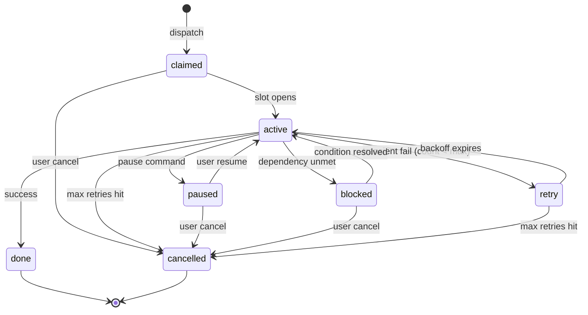

# ClawDE Local Task Queue — Specification

**Feature:** F-CLAWDE:task-queue  
**Ticket:** P1-E2-W5-S05-T02  
**ADR refs:** ADR-001 (service boundary), ADR-008 (hook contract)  
**Status:** Planned (P1 spec)

The ClawDE local task queue is the SQLite-backed mechanism inside `clawd` that tracks
in-progress workstation jobs dispatched from the inbox watcher (P1-E2-W5-S05-T01). It is
entirely local — no Postgres, no Hasura, no external dependency. All queue state lives in
`~/.config/clawde/<workspace>.db` alongside other `clawd` SQLite tables per ADR-001.

---

## 1. 7-State Machine

### States

| State | Meaning |
|---|---|
| `claimed` | Task accepted by the queue; waiting for a concurrency slot |
| `active` | Executing — an agent holds this task and is writing checkpoints |
| `paused` | Explicitly paused by the user or a policy rule; slot is **held** |
| `blocked` | Cannot proceed until a dependency or user decision is resolved |
| `done` | Completed successfully — terminal; slot released |
| `retry` | Transient failure; scheduled for re-execution after backoff |
| `cancelled` | Permanently terminated (user cancel, max-retry exhaustion, or policy) — terminal; slot released |

> **Slot release rule (LEDGER §G):** A concurrency slot is released on exactly three conditions:
> `done`, `cancelled`, or retry-count-exhausted-to-cancelled (i.e., `retry_count >= max_retries`
> transitions the task to `cancelled` with `failure_reason`). A bare `retry` or `blocked` state
> does NOT release the slot. A `paused` state holds the slot until resume or explicit cancel.

### Transition Table

| From | To | Trigger | Exit action |
|---|---|---|---|
| — | `claimed` | Queue receives dispatched task | Write task YAML; enqueue for slot |
| `claimed` | `active` | Concurrency slot opens; agent picks up | Start checkpoint timer (5 min) |
| `claimed` | `cancelled` | User cancel before execution | Write `failure_reason: user_cancel` |
| `active` | `paused` | User or policy pause command | Flush checkpoint; hold slot |
| `active` | `blocked` | Agent reports unresolvable dependency | Write blocked reason; hold slot |
| `active` | `done` | Agent reports success | Write final checkpoint; release slot |
| `active` | `retry` | Transient failure; `retry_count < max_retries` | Hold slot; schedule backoff |
| `active` | `cancelled` | `retry_count >= max_retries` | Write `failure_reason`; release slot |
| `paused` | `active` | User resumes | Reload checkpoint; re-acquire slot |
| `paused` | `cancelled` | User cancel while paused | Write `failure_reason: user_cancel` |
| `blocked` | `active` | Blocking condition resolved | Reload checkpoint; proceed |
| `blocked` | `cancelled` | User cancels blocked task | Write `failure_reason` |
| `retry` | `active` | Backoff expires | Re-acquire slot; increment `retry_count` |
| `retry` | `cancelled` | `retry_count >= max_retries` | Write `failure_reason: max_retries_exceeded` |

### Notification Events

Certain transitions emit a notification to the workstation UX layer
(handled by T03 S05 — not this ticket):

| Transition | Notification event |
|---|---|
| `claimed` → `active` | none (silent) |
| `active` → `done` | `task-completed` |
| `active` / `retry` → `cancelled` (max retries) | `task-failed` |
| `claimed` / `active` / `paused` → `cancelled` (user) | `task-failed` |
| `active` → `blocked` | `task-blocked` |
| `paused` → `active` | none (silent) |
| `blocked` → `active` | none (silent) |
| `retry` → `active` | none (silent) |

### State Machine Diagram



---

## 2. Task File Schema

Every task lives at:

```
.claude/tasks/queue/{task-id}.yaml
```

The `task-id` is a UUID v4 generated at dispatch time.

### Required Fields

```yaml
id: "550e8400-e29b-41d4-a716-446655440000"  # UUID v4 — immutable
title: "Process bug report from nself"
type: bug             # matches CRD message type (10 types — see §5)
priority: high        # critical | high | medium | low
status: claimed       # 7-state enum above
agent_id: ""          # agent holding this task (empty until active)
created_at: "2026-06-01T12:00:00Z"   # ISO 8601
updated_at: "2026-06-01T12:00:05Z"   # ISO 8601 — updated on every transition
retry_count: 0        # increments on each retry attempt
max_retries: 3        # configurable per-type; default 3
checkpoint_path: ".claude/tasks/checkpoints/550e8400-e29b-41d4-a716-446655440000.json"
failure_reason: ""    # populated only on cancelled state
source_message: ".claude/archive/inbox/msg-2026-06-01-bug-001.md"  # archived original
chain_id: ""          # CRD chain_id for correlation
reply_to: ""          # path to reply inbox (for escalation)
```

### PEWS Compatibility

This schema is a superset of the PEWS `ticket.yaml` convention. Fields `id`, `title`,
`status`, `created_at`, `updated_at`, `depends_on`, and `blocks` follow PEWS semantics.
Fields specific to the local queue (`retry_count`, `max_retries`, `checkpoint_path`,
`failure_reason`, `source_message`) are additive. A PEWS reader will ignore unknown fields;
the queue reader treats missing PEWS fields as optional.

---

## 3. Concurrency Model

### Default

`max_concurrent_tasks = 3` — at most 3 tasks can be in `active` state simultaneously
across a single watched workspace.

### Configuration

Override in `~/.config/clawde/task-queue.toml`:

```toml
[queue]
max_concurrent_tasks = 3    # default; range 1..=10
max_retries = 3             # per-task default; override per-type in [retry_policy]
```

### Slot Semantics

- Tasks beyond the limit enter `claimed` holding state (FIFO queue).
- When a slot opens (a task transitions to `done` or `cancelled` per LEDGER §G), the highest-
  priority `claimed` task immediately moves to `active`.
- Within the same priority band, ordering is FIFO by `created_at`.
- A higher-priority `claimed` task preempts a slot ahead of lower-priority tasks waiting in
  the `claimed` queue — it does NOT preempt an already-`active` task.

### Priority Bands (high → low)

`critical` > `high` > `medium` > `low`

---

## 4. Checkpoint Protocol

### Write Schedule

Every `active` task writes a checkpoint every **5 minutes** while it is running.
The agent is responsible for writing this file; `clawd` monitors the checkpoint age
and transitions the task to `blocked` if no write occurs for 10 minutes (double the cadence).

### Checkpoint Location

```
.claude/tasks/checkpoints/{task-id}.json
```

### Checkpoint Schema

```json
{
  "task_id": "550e8400-e29b-41d4-a716-446655440000",
  "percent_complete": 45,
  "last_action": "Analyzed stack trace; identified root cause in cli/internal/trust/ports_macos.go",
  "next_action": "Write fix for the identified race condition",
  "agent_id": "claude-sonnet-4-6:a1b2c3",
  "written_at": "2026-06-01T12:35:00Z"
}
```

### Daemon Restart Resume

On `clawd` restart, for every task in `active` state:
1. Read `checkpoint_path`.
2. If checkpoint exists and `written_at` is within 10 minutes: resume with `next_action`.
3. If checkpoint is missing or stale: transition to `retry` (or `blocked` if `retry` is
   not allowed for this task type — see §5).

---

## 5. Retry Policy

### Default Parameters

- **Max retries:** 3 (configurable in `task-queue.toml`)
- **Backoff schedule:** 5s → 15s → 45s (exponential)

### Retry Decision Matrix

| Task type | Retry on failure? | Rationale |
|---|---|---|
| `bug` | **yes** | Transient tool failures are common; worth 3 attempts |
| `hotfix` | **yes** | Same as bug — urgency argues for retry |
| `question` | **yes** | Answer may fail on first parse; retry is safe |
| `test-request` | **yes** | Test environment flakes; retry is safe |
| `info` | **no** | Notification-only; retry adds no value |
| `resolution` | **no** | Idempotent close action; duplicate is harmful |
| `feature` | **no** | Planning action; surfaced to user as idea, not retried |
| `enhancement` | **no** | Same as feature |
| `idea` | **no** | Same as feature |
| `deploy-request` | **no** | Escalated via `pci-send`; never retried locally |

### After Max Retries

When `retry_count >= max_retries`, the task transitions to `cancelled` with
`failure_reason: max_retries_exceeded` appended. A `task-failed` notification is emitted
to the workstation UX layer.

---

## 6. ATP/PEWS Alignment Table

The local queue is a **superset** of the PEWS ticket status enum. Every PEWS status maps
to a local queue state; several local states have no PEWS equivalent.

| Local queue state | PEWS ticket status | Notes |
|---|---|---|
| `claimed` | `pending` | Closest equivalent: task accepted but not started |
| `active` | `open` | Task in flight; agent is executing |
| `paused` | *(no PEWS equivalent)* | Local-only: user or policy suspended the slot |
| `blocked` | `blocked` | Direct mapping; both indicate unresolvable dependency |
| `done` | `done` | Terminal success; direct mapping |
| `retry` | *(no PEWS equivalent)* | Local-only: transient failure between attempts; pre-active |
| `cancelled` | `failed` | Terminal failure; maps to PEWS `failed` |

> **Note:** PEWS also has `reviewed` and `closed` — these are post-done review states that
> do not apply to the local task queue (queue tasks go straight from `done` to archive).
> The local queue never transitions a task to `reviewed` or `closed`.

---

## 7. Integration Test Plan

The following integration scenarios must pass before this feature is marked ✅ Done:

| # | Scenario | Expected outcome |
|---|---|---|
| 1 | Create task via dispatch | `.claude/tasks/queue/{id}.yaml` exists; `status: claimed` |
| 2 | Activate task (slot opens) | `status: active`; checkpoint file written within 5 min at `.claude/tasks/checkpoints/{id}.json` |
| 3 | Pause active task | `status: paused`; checkpoint flushed |
| 4 | Resume paused task | `status: active`; `next_action` matches `checkpoint.next_action` |
| 5 | Cancel active task | `status: cancelled`; `failure_reason: user_cancel`; slot released |
| 6 | Exhaust retries | After 3 retry cycles: `status: cancelled`; `failure_reason: max_retries_exceeded`; `task-failed` notification emitted |
| 7 | Daemon restart with active task | Task resumes from checkpoint `next_action` |
| 8 | Priority preemption | A `critical` task jumps ahead of a `low` task in `claimed` queue when a slot opens |

### Verification Commands

```bash
# Scenario 1 — task file exists
ls .claude/tasks/queue/<task-id>.yaml
grep "status: claimed" .claude/tasks/queue/<task-id>.yaml

# Scenario 2 — checkpoint written
ls .claude/tasks/checkpoints/<task-id>.json
cat .claude/tasks/checkpoints/<task-id>.json | python3 -m json.tool

# Scenario 5 — cancel and slot release
grep "failure_reason: user_cancel" .claude/tasks/queue/<task-id>.yaml

# Scenario 6 — max retries
grep "retry_count: 3" .claude/tasks/queue/<task-id>.yaml
grep "failure_reason: max_retries_exceeded" .claude/tasks/queue/<task-id>.yaml

# Stub grep — no TODOs in this spec
grep -rn "TODO\|TBD\|placeholder\|populate at Build" \
  clawde/.github/wiki/task-queue-spec.md
```

---

## 8. Related Documents

- `clawde/.github/wiki/Architecture.md` — system overview; Task Queue section
- `clawde/.github/wiki/crd-parity-spec.md` — inbox watcher + routing rules (T01 S05)
- `.claude/docs/AGENT-TASK-PROTOCOL.md` — ATP + ClawDE local task queue addendum
- ADR-001 — clawd SQLite storage decision
- ADR-008 — host adapter hook contract
- P1-E2-W5-S05-T01 — inbox watcher (dispatcher)
- P1-E2-W5-S05-T03 — notification UX (consumer of task events)
